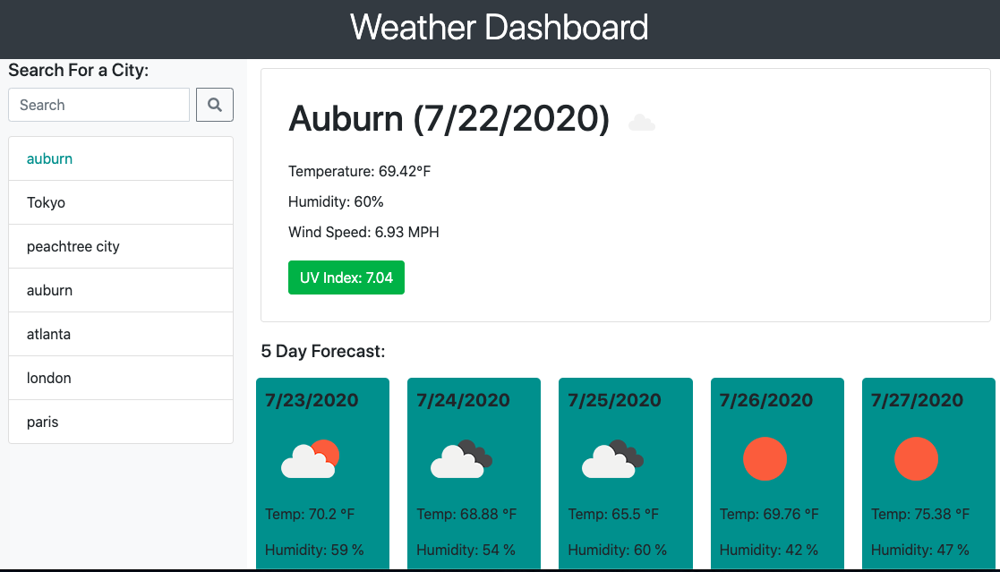

# weather-dashboard
A weather dashboard utilizing OpenWeather API to provide weather data by city. 

Link: <a href=""> Click to view Weather Dashboard</a>

Description: 

A weather dashboard website utilizing data from OpenWeather API to show current weather and a 5-Day Forecast. The dashboard combines HTML, CSS, JavaScript, JQuery, moment.js, OpenWeather API, and local storage. When the user types in a city in the sidebar and clicks the search button, then the city's current weather (including: city name, date, weather icon, temperature, humidity, UV index, and wind speed) and 5-Day Forecast are given on the page, and the city name is shown below the search bar. If the user clicks the name of the city, then the city's weather will be given on the page.

Screenshots:

Weather Dashboard Page

If you need support please email me at:
gnatalie.booking@gmail.com